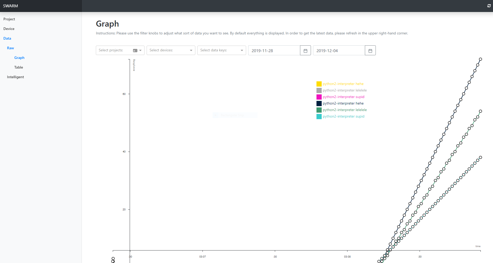

# iot
IOT for the SWARM project.


# Installation for a Raspberry Pi (no sudo)
Use this option if your Raspberry Pi code does **NOT** need `sudo` to run. In this example we're using Python 2.
```bash
cd some-folder
git clone iot
cd iot
# this will install iot inside of your Python
python -m pip install .
```

# Installation for a Raspberry Pi (sudo) [Python 3]
Use this option if your Raspberry Pi code **does** need `sudo` to run. Please be careful. In this example we're using Python 3.
```bash
cd some-folder
git clone iot
cd iot
# this will install iot inside of your Python
sudo python3 -m pip install .
```

# Example Code
```python
import time
import iotlib

device_id = iotlib.get_device_id('http://swarm-fau.eastus.cloudapp.azure.com:6969/api/v0/device', 'example-device', 'example', 'example-device-id-file', metadata=dict(testing=True, fake_data=True))
project_id = iotlib.get_project_id('http://swarm-fau.eastus.cloudapp.azure.com:6969/api/v0/project', 'example', 'example-project-id-file')

for i in range(0, 100):
  iotlib.post_data('http://swarm-fau.eastus.cloudapp.azure.com:6969/api/v0/raw_data', device_id, project_id, dict(supid=i + 2, hehe=i * 2, lelelele=i * 3 / 2))
  time.sleep(1)
```
Now go to (SWARM)[http://swarm-fau.eastus.cloudapp.azure.com/data/raw/graph] and select your Project or Devices and have a look. You should see a linear graph that looks like this: 


# Scripts
```bash
# development localhost api / website
python iot/test/device.py --cache /var/log/iot/local/0 --device device0 --sample 5 --project example
python iot/test/device.py --cache /var/log/iot/local/1 --device device1 --sample 5  --project alternate-example


# production api / website
python iot/test/device.py --cache /var/log/iot/remo/0 --device device-0 --sample 5  --endpoint http://swarm-fau.eastus.cloudapp.azure.com:6969/api/v0 --project example
python iot/test/device.py --cache /var/log/iot/remo/1 --device device-1 --sample 5  --endpoint http://swarm-fau.eastus.cloudapp.azure.com:6969/api/v0 --project alternate-example
```


<!-- todo -->
!!!!! can't read property name of undefined
add color settings
responsive submit button, do a checkbox or some shit
